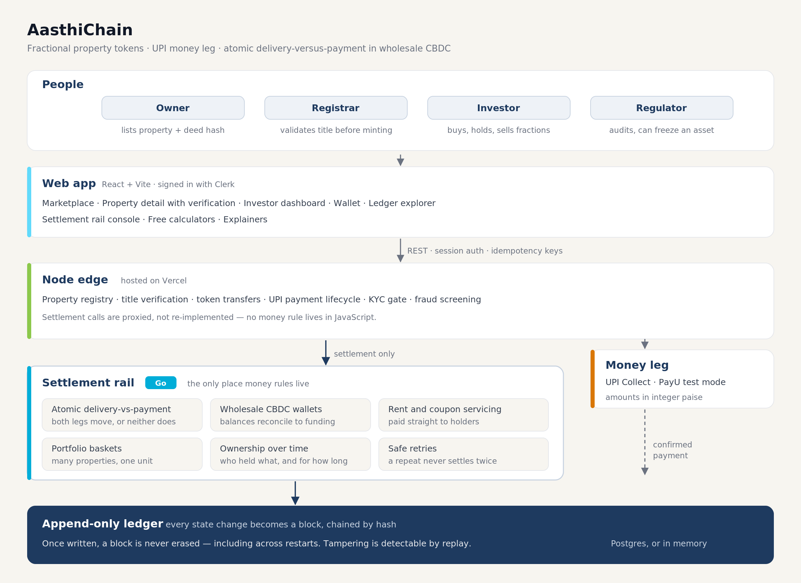

<div align="center">

# AasthiChain

### Own premium Indian real estate from ₹500

**Fractional property tokens on a hash-chained ledger · UPI money leg · atomic delivery-versus-payment**

[](https://aasthi-chain.vercel.app)
[](drunix-gateway/)
[](frontend/)
[](LICENSE)

[Live site](https://aasthi-chain.vercel.app) · [Free calculators](https://aasthi-chain.vercel.app/tools) · [Learn](https://aasthi-chain.vercel.app/learn) · [Ledger explorer](https://aasthi-chain.vercel.app/ledger) · [UMI rail](https://aasthi-chain.vercel.app/umi)

</div>

---

## The problem

A premium flat costs ₹75 lakh. You cannot buy 0.1% of it. Selling takes months, the paperwork is
opaque, and the money leg has nothing to do with the ownership record — you pay, then you wait, and
you trust someone to update a register.

## What this is

AasthiChain converts a verified property into a fixed number of tokens. A ₹75 L villa becomes
**15,000 tokens at ₹500**. You buy 100 for ₹50,000 and own that fraction outright. The payment and
the ownership transfer are one atomic operation — both move, or neither does.

|  | |
|---|---|
| **₹500 minimum** | not ₹75 lakh |
| **Atomic settlement** | money and tokens move together, or both roll back |
| **Scarce by design** | you can only buy tokens that exist; sold-out supply is visible, never oversold |
| **One deed, one tokenization** | the same document can never be tokenized twice |
| **Independently verified** | a Registrar — never the owner — validates title before any token is minted |
| **Auditable** | every state change is a block on a hash-chained, append-only ledger |

> **Honest scoping.** The settlement rail is a faithful **simulation**. There is no public UMI API
> and no live NPCI credential available outside a bank partnership — real access is the SEBI
> Regulatory Sandbox. Every simulated surface is labelled as such in the UI and in the API
> responses. What is real: the ledger, the atomicity, the verification rules and the guardrails.

---

## Architecture

<div align="center">



</div>

**Design rule:** settlement logic is written in **Go**, next to the ledger. The JavaScript layers are
transport only. If a rule about money lives in JavaScript, that is a bug.

Listing is gated to the **Owner** role, so tokens always mint to the party that holds the asset — an
Investor can never end up "owning" a property merely by creating the listing.

---

## What you can do

### Buy a fraction

Browse the marketplace, open a property, buy from ₹500. Payment and ownership settle together: a
buyer who cannot pay gets nothing, and the seller keeps every token. Before the money moves, the
app quietly asks the rail whether the trade would settle, so a shortfall is shown as a sentence
rather than discovered as a failure afterwards.

### Check that a listing is real

Every property page carries a verification panel that answers, in plain language:

- was the title validated by a registrar, and **who** — the owner validating their own listing is
  refused outright
- is the deed fingerprinted, and does it collide with any other listing
- does the ledger still replay cleanly from the beginning

You can prove your own copy of the deed matches the one on the ledger without uploading anything:
hash the file locally and paste the result.

### Hold many properties as one unit

A **basket** is a single tradeable unit backed by a fixed recipe of several properties — two tokens
of one, one of another. Creating a unit moves the underlying tokens into custody, which is what
makes the unit redeemable rather than notional, and the backing is shown per asset. Units can be
sold for cash, transferred, or redeemed back into the real underlying tokens. A basket that is not
fully backed is never allowed to look healthy.

### Earn rent, split fairly

Rent and coupons are paid straight into holders' wallets. The split can follow a snapshot of who
holds what today, or **how long each holder actually held** — so someone who bought yesterday does
not collect a full quarter's rent, and someone who sold mid-quarter still earns for the days they
held.

### See the whole history

Ownership is kept as a journal of changes, not just a current balance, so the register can be
replayed for any window. The ledger explorer shows every block; the investor dashboard shows
holdings, income and settlement history in one place.

---

## The settlement rails

### UMI — the Demat 2.0 cash leg

In September 2026 SEBI and RBI launched **Demat 2.0**: bonds issued as native tokens on the
depositories' permissioned DLT, with the **cash leg settled in wholesale CBDC (e₹-W)** through the
Unified Market Interface — ₹1,025 crore issued by REC, L&T and IIFL. AasthiChain already had both
ends. This is the middle.

- **Atomic DvP.** Both legs move or neither does; a failure leaves no half-settled state behind.
- **Central bank money is conserved.** Wallet balances always reconcile against lifetime funding —
  the rail can neither create nor destroy money, and no floats go anywhere near it.
- **Programmable servicing.** Rent and coupons are paid pro-rata on the due date, with no registrar
  file exchange.
- **Safe retries.** A repeated settlement request returns the original outcome instead of settling
  twice, and a failure stays a failure.
- **Standards trace.** Every instruction carries the ISO 20022 message family a real
  securities-settlement rail would emit.

Settlement refusals are always specific — which side was short, and by how much — never a generic
error.

### Money leg — UPI Collect

UPI Collect with amounts held in integer paise, moving through a payment lifecycle rather than a
single hop. **PayU test mode** gives a genuine PSP round-trip: signed requests, verified callbacks
and reconciliation against the provider. Every payment is risk-screened by an explainable fraud
engine before approval. Settlement behind it stays simulated; no real money moves.

---

## What is guaranteed

**The ledger is append-only and survives restart.** Blocks are written to durable storage before
in-memory state is updated. Once committed, a block is never erased — including across process
restarts — and tampering is detectable because each block carries the hash of its predecessor.

**Supply is scarce.** Tokens cannot exceed the authorised supply of a property, and an owner's
unsold stock is never counted as allocated.

**Holder identity is private.** Anonymous reads of a property return `Investor A`, `Investor B`, …
with a holder count. Real identities require authentication, so the marketplace stays publicly
browsable without leaking a cap table.

**Approval is independent.** Title validation is restricted to a Registrar, and refused when the
validating identity is the one that registered the property.

---

## Authentication

**Sign-in is the only way in.** Production uses **Clerk**, with signatures verified against Clerk's
published keys. Public routes — the marketplace, the ledger explorer, the calculators and the
articles — remain open to visitors and crawlers. Money routes require a session.

Demo role buttons are gone: the entry points are removed from the production bundle, old sessions
are evicted on load, and the development login endpoint stays closed unless explicitly enabled.

> **Operational note:** leave `DEMO_AUTH` **unset** in production, and set `CLERK_ISSUER` to your
> Clerk Frontend API URL so anything unverifiable fails closed.

---

## Free tools and explainers

Single-purpose calculators, each a public page that stands on its own. All INR, all Indian tax and
stamp-duty rules, no sign-up.

| Tool | What it answers |
|---|---|
| [Rental yield](https://aasthi-chain.vercel.app/tools/rental-yield-calculator) | gross vs net yield after maintenance, tax and vacancy |
| [Fractional investment](https://aasthi-chain.vercel.app/tools/fractional-investment-calculator) | what ₹X buys, and what it returns |
| [Stamp duty & registration](https://aasthi-chain.vercel.app/tools/stamp-duty-calculator) | state-wise duty on `max(price, circle rate)`, capped registration, 1% TDS above ₹50 L |
| [Home loan EMI](https://aasthi-chain.vercel.app/tools/home-loan-emi-calculator) | EMI, amortisation, s.24(b) and 80C relief |
| [Rent vs buy](https://aasthi-chain.vercel.app/tools/rent-vs-buy-calculator) | the year the two curves cross |
| [Capital gains tax](https://aasthi-chain.vercel.app/tools/capital-gains-tax-calculator) | LTCG/STCG, the 23 Jul 2024 regime change, grandfathering, s.54 / 54EC / 54F |

Explainers: [Demat 2.0](https://aasthi-chain.vercel.app/learn/what-is-demat-2) ·
[Unified Market Interface](https://aasthi-chain.vercel.app/learn/what-is-umi) ·
[Atomic DvP](https://aasthi-chain.vercel.app/learn/what-is-atomic-dvp)

---

## Quick start

```bash
# 1 — frontend only (no Go, no Docker)
cd frontend && npm install && npm run dev        # :5173

# 2 — with the Go settlement rail
cd drunix-gateway && go run ./cmd/gateway                       # :21100
DEMO_AUTH=true UMI_GATEWAY_URL=http://localhost:21100 node server.js  # :8080

# 3 — everything, including the Fabric network
cd network && docker-compose up -d && ./scripts/create-channel.sh
```

Or `make umi`.

**Seeing "Rail offline" on the deployed site?** Expected. Vercel runs only the Node edge; the Go rail
needs a host. `render.yaml`, `drunix-gateway/Dockerfile` and `drunix-gateway/fly.toml` are included —
deploy it, then set `UMI_GATEWAY_URL` on Vercel and redeploy.

### Environment

| Variable | Where | Purpose |
|---|---|---|
| `VITE_CLERK_PUBLISHABLE_KEY` | Vercel | Clerk auth. Use a `pk_live_` production key. |
| `UMI_GATEWAY_URL` | Vercel | points the proxy at the Go rail |
| `DATABASE_URL` | rail host | Postgres — durable blocks. Without it, in-memory. |
| `UMI_ENABLED`, `UMI_SEED_DEMO`, `DRUNIX_MODE` | rail host | rail configuration |
| `CLERK_ISSUER` | Vercel | Clerk Frontend API URL. Set it to enforce signature verification. |
| `ADMIN_DASHBOARD_KEY` | Vercel | private analytics page |
| `DEMO_AUTH` | — | **leave unset in production** |
| `NPCI_MODE`, `PAYU_MERCHANT_KEY`, `PAYU_SALT` | local | `mock` · `payu` · `real` |

Credentials are never committed; `.env.payu` is gitignored.

---

<details>
<summary><b>What is live vs simulated</b> — click to expand</summary>

**Live and real:** the chaincode and its duplicate-deed guard, the hash-chained append-only ledger,
the Go pipeline, atomic DvP and its rollback, safe retries under concurrency, conservation of money,
registrar-only title validation, Clerk authentication and Postgres persistence.

**Simulated, and labelled as such:** the NPCI UPI rail (no live credentials exist outside a bank
partnership), wholesale CBDC wallets (e₹-W is an RBI pilot, not a public API), the UMI rail itself
(real access is the SEBI Regulatory Sandbox), DigiLocker KYC (Requester onboarding needs entity
registration, an official domain, India-hosted servers and a MeitY review), the land-record hash,
and the Sepolia escrow experiment.

**PayU test mode is genuinely real** as far as it goes: signed requests are accepted by PayU's test
environment, and tampered amounts and bad signatures are rejected by them, not by us. Only the
settlement behind it is simulated.

</details>

<details>
<summary><b>Regulatory context</b> — click to expand</summary>

The **Asset Tokenisation (Regulation) Bill 2026** is a pending Private Member's Bill, not law. It
proposes KYC/AML obligations, a registered custodian, registrar validation and a regulator freeze
power. AasthiChain maps to all four: a Registrar org validates title, a Regulator org can freeze, the
cap table is auditable end to end, and the payment path enforces a KYC gate.

**SPV structure.** Real platforms wrap each property in a special-purpose vehicle, so a token is a
beneficial interest in the SPV that holds legal title (Registration Act 1908 + the 2026 Bill). That
is a legal structure, not a code change, and is documented as Phase 2 rather than built.

</details>

---

## Support

The in-app [Support page](https://aasthi-chain.vercel.app/support) carries UPI and GitHub Sponsors
links. These are **donations to the project, not investments** — they buy no tokens and no stake.

<div align="center">

**[aasthi-chain.vercel.app](https://aasthi-chain.vercel.app)** · MIT licensed

</div>
